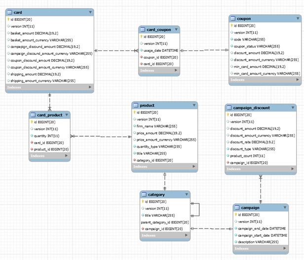
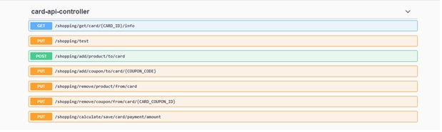
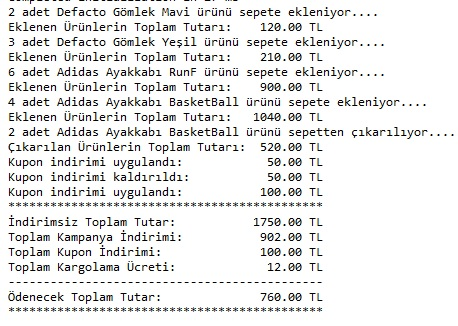
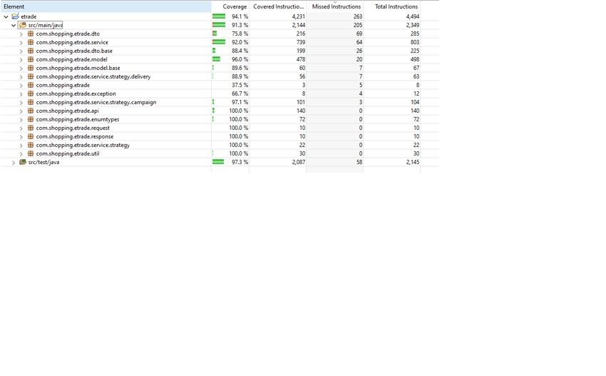

SHOPPING CARD DEVELOPMENT

Bu uygulama SpringBoot web service olarak geliştirilmiş olup, aşağıdaki teknolojiler kullanılmıştır:

•	Java 8
•	Jpa
•	RestAPI
•	Lombok
•	mySQL
•	Junit
•	Mockito
•	AssertJ
•	Swagger-UI
•	Log4J

Uygulamanın data modeli şu şekildedir:

 

CARD: Sepetin ücret bilgilerinin tutulduğu ana tablodur.

CARD_PRODUCT: Sepete eklenmiş olan ürün ile ilişkiyi sağlayan tablodur. Quantity alanında tutulan değer kadar, ilgili üründen sepete eklenmiştir.

PRODUCT: Ürünün adının, birim ücretinin, ürünün markasını(firm_name) ve bağlı olduğu kategorinin id’sini tutar.

CATEGORY: Kategori temel bilgilerini tutar. Parent_category_id ile recursive şekilde üst kategorilere ulaşılabilir. Kategorinin bağlı bulunduğu kampanya campaign_id kolonu üzerinden foreign_key ilişkisi içerisinde erişilebilir.

CAMPAIGN: Kampanya bilgilerinin tutulduğu tablodur. Kampanya başlangıç ve bitiş tarihleri kontrol edilerek, kampanyanın aktif olup olmadığı anlaşılabilir.

CAMPAIGN_DISCOUNT: Sepete eklenen ürün sayısına göre indirimin stratejisinin tutulduğu tablodur. Discount_type alanı RATE ise, yani kampanyada oransal indirim uygulanacaksa, product_count (ilgili kampanyaya bağlı sepetteki ürün sayısına) alanına göre, indirimde oransal hesaplama yapılır. Discount_type alanı AMOUNT ise, product_count sayısına göre indirimde tutar hesaplaması yapılır. 3’ten fazla ürün için product_count sütununda -1 değeri tutulur.

COUPON: Sistemde mevcut indirim kuponlarının tutulduğu tablodur. Code alanında kuponun kodu, discount_amount alanında indirim tutarı ve min_card_amount alanında, kullanılması için sepet ücretinin minimum tutarı tutulur. Coupon_status alanı ACTIVE veya USED olabilir.

CARD_COUPON: Sepette indirimi kullandırılmış kuponların tutulduğu tablodur. Usage_date alanı, kuponun sepete eklendiği zamanı tutar.

UYGULAMA KURULUMU

Uygulama java-8 üzerinde çalışmaktadır. Lokal ortamda kullanmak için makinenizde Java-8, mySQL ve Lombok kurulumlarının yapılmış olması gerekmektedir.

Free-licence olduğu için mySQL veritabanı kullanılmıştır. Entity düzeyinde mapleme ve jpa kullanıldığı için uygulama veritabanı bağımsız çalışmaktadır.

Veritabanını değiştirmek isterseniz, proje içerisinde bulunan application.properties dosyanında veritabanı erişim bilgilerini değiştirmeniz yeterli olacaktır.

Uygulamayı kullanmak için etrade adında bir veritabanı yaratmanız gerekmektedir. Veritabanı ismini değiştirmek için yine application.properties dosyasında değişiklik yapabilirsiniz.

BACK-END MODELİ

Back-end modeli restful web service olarak tasarlanmıştır. Uygulama için gerekli servislere CardApiController üzerinden erişilebilir.

Her bir veritabanı tablosu için bir entity oluşturulmuştur. Örnek: Card.java, Product.java….

Her bir entity’e erişim sprint data ile repository class’ları üzerinden sağlanmaktadır. Örnek: CardRepository.java, ProductRepository.java

Parasal veri tipleri Money class’ı ile modellenmiştir. 
Her bir tablonun alanları unique olarak generate edilmiş olup, aynı anda tabloya erişimlerde verinin bütünlüğünü korumak için version alanı da tablolara eklenmiştir. Her bir entity IdVersion abstract class’ını extend ederek, tüm tabloların aynı şekilde davranması sağlanmıştır.

Her modelin üzerinde bağımsız işlemleri yapan Command ve Query servisleri çalışmaktadır.Command servisler transactional olup, transaction bütünlüğünün korunmasının zorunlu olduğu create, update, delete işlemlerini çağıran methodları içermektedir. Query servisleri ise transactional olmayıp, sadece okuma amaçlı işlemleri yapan servislerdir.

Hem kampanya indirimi hem de kargo ücreti hesaplamaları, ürün adedi, ürün kategorisi, farklı firmaların ürünlerinin sepete eklenebilmesiyle değişkenlik gösterebildiği için Strategy Pattern’ı ile hesaplanmıştır.
(Bakınız: IDeliveryStrategy, IDiscountStrategy)

Hata mesajları için custom exception handling yapılmıştır.

Alan zorunlulukları Annotation’lar ile sağlanmıştır.

Parasal hesaplama işlemleri MoneyDTO içerisinde encapsulate edilmiştir.

Kur çevrimleri için ExchangeUtil class’ı oluşturulmuştur.

Statü ve tip alanları için enum değerleri kullanılmıştır.

Projenin dışarı açıldığı, CardApiController’dan DTO objeleri olarak servis sonuçları döndürülmüş, data objelerinin dışarıdan erişimi engellenmiştir.

Loglama için log4J Logger sınıfı kullanılmıştır.

ÖRNEK UYGULAMA KULLANIMI

Uygulama server’I ayağa kalktığında resources altında bulunan insert_sql otomatik olarak çalışarak, gerekli verileri tablolara doldurmaktadır.

Uygulama swagger-ui ile, localhost:8080/swagger-ui.html sayfasından aşağıdaki şekilde açılabilir.

  

Burada API’deki ilgili servisleri çağırabilirsiniz.

/shopping/test servisi ile Console’dan ya da log dosyalarından aşağıdaki şekilde işlem sonuçlarını görebilirsiniz. 

 
 
 UNIT TEST
Unit testler junit ile yazılmıştır. Coverage oranları aşağıdaki gibidir:

  
 

